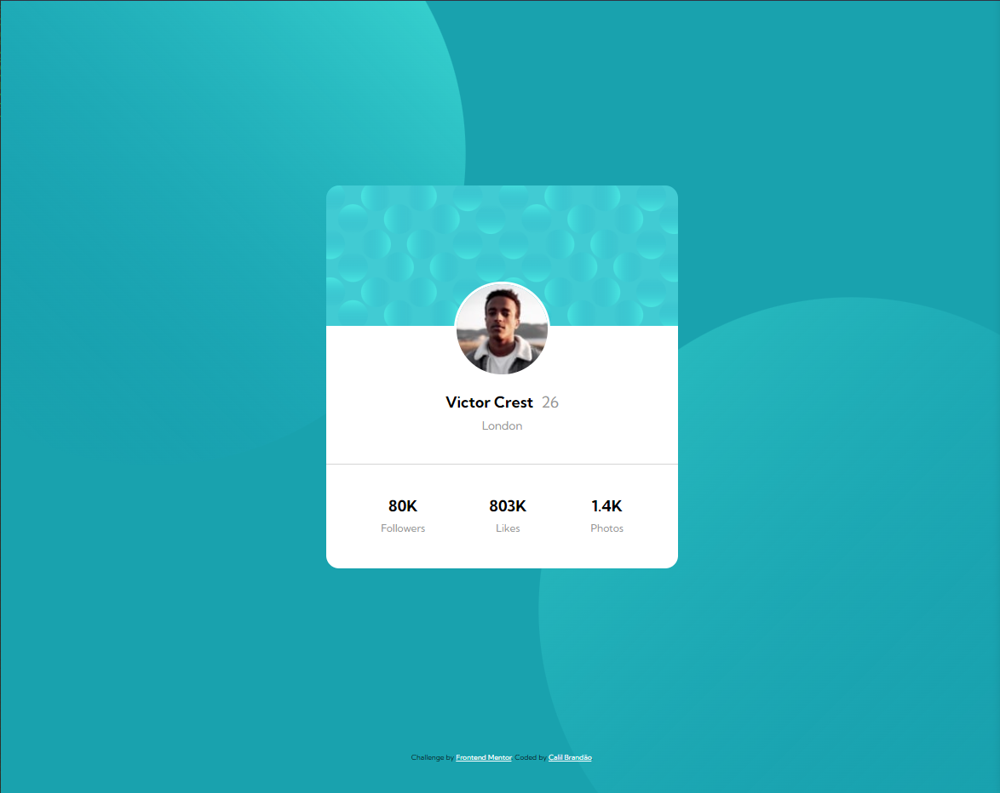
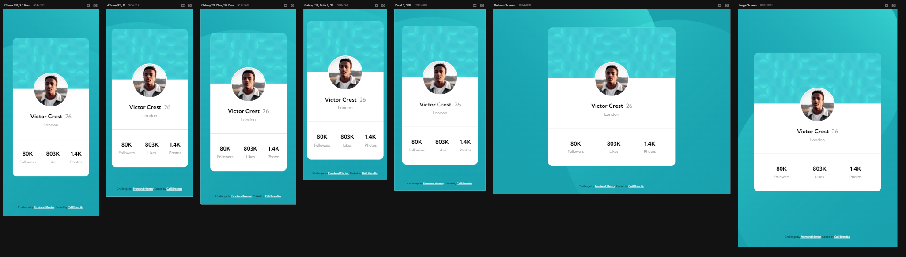

# Frontend Mentor - Profile Card Component

This is a solution to the [Profile Card Component](https://www.frontendmentor.io/challenges/profile-card-component-cfArpWshJ/hub). Frontend Mentor challenges help you improve your coding skills by building realistic projects. 

## Table of contents

- [Overview](#overview)
  - [The challenge](#the-challenge)
  - [Screenshot](#screenshot)
  - [Links](#links)
- [My process](#my-process)
  - [Built with](#built-with)
  - [What I learned](#what-i-learned)
- [Author](#author)

## Overview

### The challenge

Users should be able to:

- View the optimal layout depending on their device's screen size

### Screenshot





### Links

- Solution URL: [Click Here](https://www.frontendmentor.io/challenges/profile-card-component-cfArpWshJ/hub)
- Live Site URL: [Click Here](https://cbrandsdev.github.io/Profile-Card-Component)

## My process

### Built with

- Semantic HTML5 markup
- CSS custom properties
- Flexbox
- CSS Grid


### What I learned

In this challenge I managed to understand how the interactive elements work using hover in the css, I also managed to implement some shadows in the layout of the information box, which makes a good impression at first glance. 
I used media settings to set different settings for different mobile devices.
I also implemented the function of assigning interactive buttons in javascript to demonstrate the chosen evaluation on the site.

```css
.card {
box-shadow: 0 .4rem .4rem rgba(0, 0, 0, 0.25), 0 18.8rem 5.2rem rgba(0, 0, 0, 0.01), 0 12.0rem 4.8rem rgba(0, 0, 0, 0.04), 0 6.8rem 4.1rem rgba(0, 0, 0, 0.15), 0 3.0rem 3.0rem rgba(0, 0, 0, 0.26), 0 .8rem 1.7rem rgba(0, 0, 0, 0.29), inset 0 .6rem .8rem rgba(255, 255, 255, 0.1), inset 0 -.4rem .5rem rgba(0, 0, 0, 0.22);
}
```

``` css
@media screen and (max-width: 688px) {
    .container {
        display: flex;
        flex-direction: column;
        align-items: center;
        justify-content: center;
        padding-top: 1100px;
    }
    .attribution{
        opacity: 0;
    }
```


## Author

- Github - [@CbrandsDev](https://github.com/CBrandsDev)
- Frontend Mentor - [@CBrandsDev](https://www.frontendmentor.io/profile/CBrandsDev)
- Twitter - [@onlythecalil](https://twitter.com/onlythecalil)

